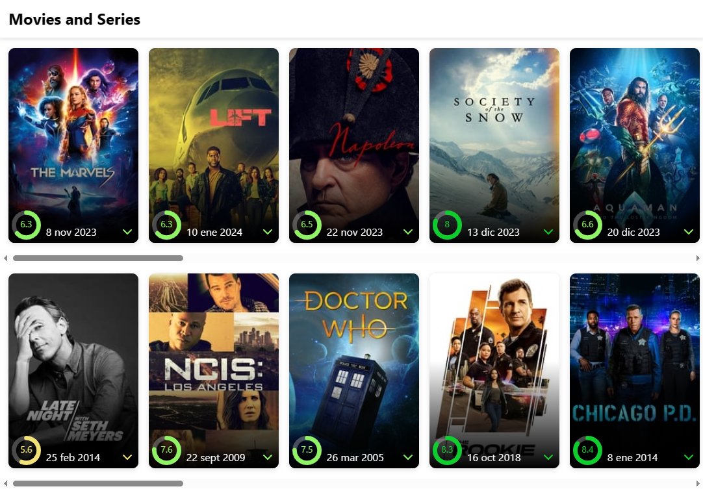

# React + TypeScript + Vite

You havo got to use TMDB.

- [login](https://www.themoviedb.org/login), if you don have an account [signup](https://www.themoviedb.org/signup)

- go to settings and click [API](https://www.themoviedb.org/settings/api) so that you can copy the API Read Acces Token

## nvm variables with vite

on the project go to .env.local file. If you don't have you can create a new one in the root directory

```
VITE_REACT_APP_BASE_URL_TMDB=https://api.themoviedb.org/3
VITE_REACT_APP_ACCESS_TOKEN_TMDB=[your API Read Acces Token]
```

## Expected result


